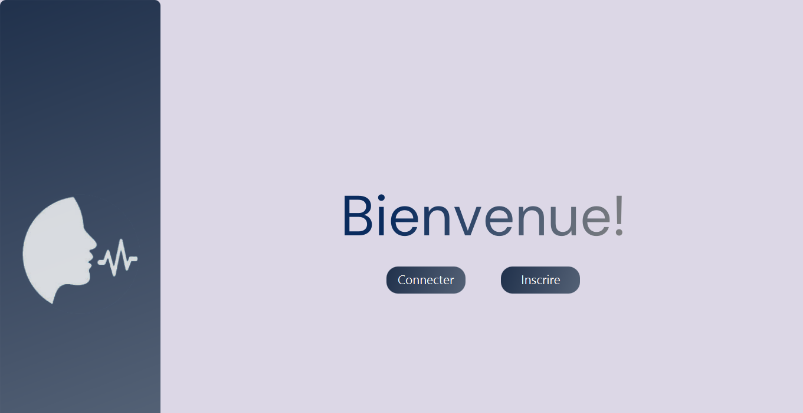
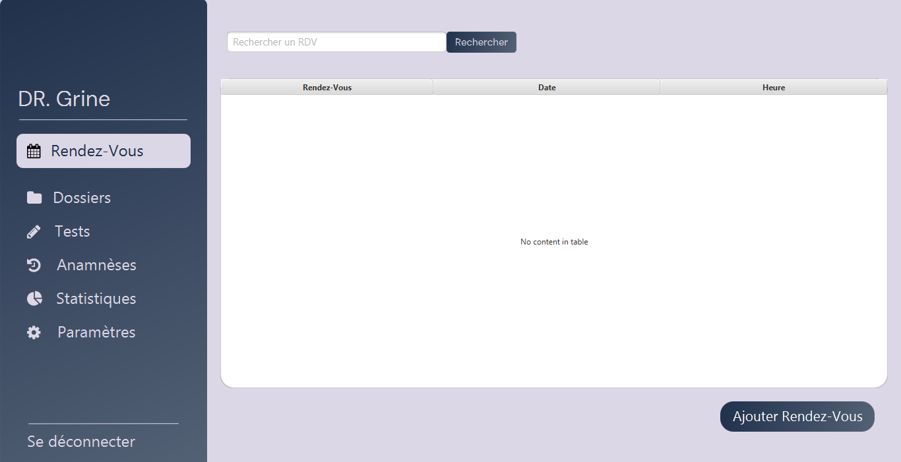
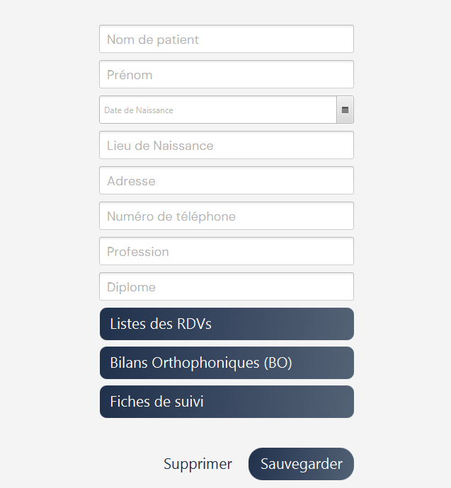

# Speech Therapy Clinic Management System

## Overview
This system is designed to assist speech therapists in managing their clinics efficiently. It provides tools for organizing appointments, patient assessments, and therapy follow-ups. The goal is to enhance the quality of care, improve patient tracking, and streamline administrative tasks.

## Key Features
- **User Registration:** Speech therapists create accounts with personal details for secure data management.
- **Appointment Scheduling:** Manage consultations, follow-up sessions (in-person or online), and group therapy workshops via an integrated calendar.
- **Speech Therapy Assessment:** Includes anamnesis, clinical tests, and diagnostic evaluations to determine patient conditions.
- **Patient Records Management:** Stores patient history, assessments, follow-up notes, and progress reports.
- **Progress Tracking:** Provides structured follow-up plans with short, medium, and long-term goals, along with scoring for progress evaluation.
- **Test & Questionnaire Customization:** Allows therapists to create, modify, and manage assessment tests and patient evaluations.
- **Statistical Insights:** Generates reports on patient progress and tracks the prevalence of specific speech disorders.

## Technologies used:
Java and JavaFX.

## Nota Bene:
This solution is intended for French-speaking users. Translation are not available for this moment.

